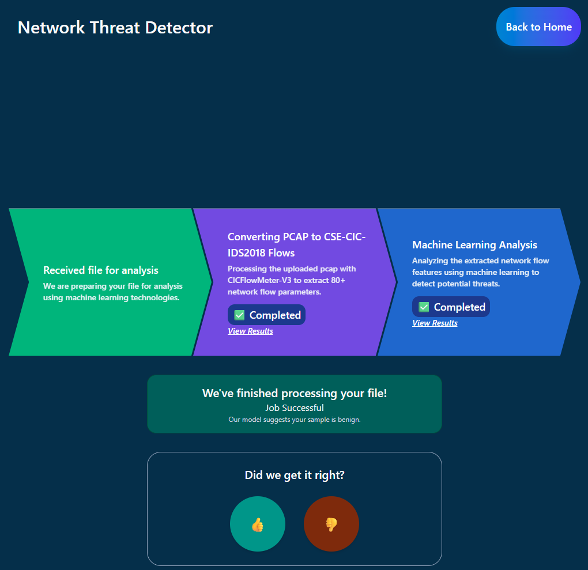

# Network Threat Detector



Detects suspicious behavior in *.pcap* files with Machine Learning. Trained on the CSE-CIC-IDS2018 dataset.

Fully containerized architecture utilizes Redis pipeline with S3 (implemented here with Minio). Scalable across different regions.

## Production Deployment

*(For single-node deployments)*

1.) Install Docker and Docker Compose

2.) In your environment, define the following variables:
```bash
# .env

REDIS_HOST=redis
REDIS_PORT=6379
REDIS_PASSWORD=<a very strong password here>

# Shown using minio (local version of AWS S3). Otherwise, remove minio from the docker-compose.yml and provide real AWS credentials.
AWS_ACCESS_KEY_ID=minio_user
AWS_SECRET_ACCESS_KEY=<another very strong password here>
AWS_DEFAULT_REGION=us-east-1 # If using minio, can be any region.
S3_BUCKET=network-threat-detector # Set to your bucket of choice
S3_ENDPOINT_URL=http://minio:9000

# Remove these variables if not needed
MINIO_ROOT_USER=minio_user
MINIO_ROOT_PASSWORD=<another very strong password here>
```

3.) **Run:**
```bash
docker compose up
```

## Development Deployment

The development compose file exposes service ports and uses weak passwords. Only use this in development!

1.) Install Docker and Docker Compose

2.) **Run:**
```bash
docker-compose -f dev-docker-compose.yml up
```

3.) Compose volumes allow Flask (backend) and Vite (frontend) debuggers to refresh upon live changes to the code.

4.) Browse the local datastore by opening `http://localhost:9001` to view the Minio web console!